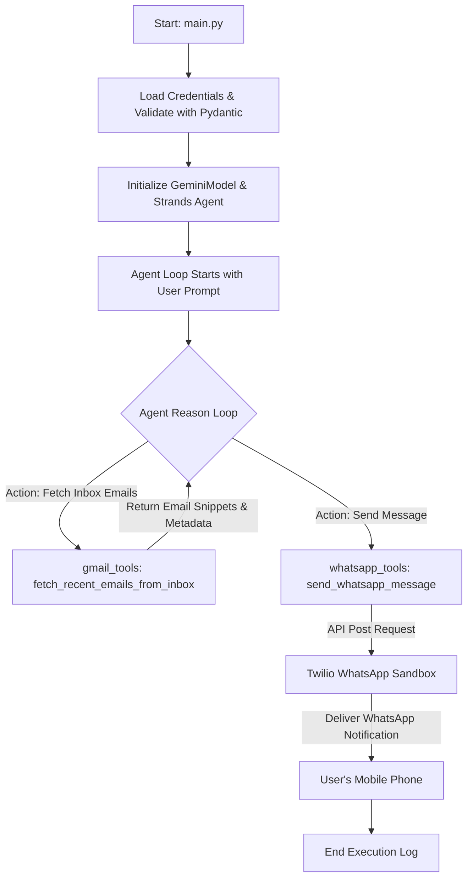

# 📧 Email to WhatsApp Automation Agent

An autonomous, production-ready AI microservice built with the **Strands Agents SDK** that retrieves recent unread emails from your Gmail Inbox, summarizes them using Google's **Gemini AI**, and dispatches the compiled summaries directly to your mobile phone via **WhatsApp**.

---

## 📊 System Architecture

The following diagram illustrates how the Strands Agent coordinates the custom tools to monitor your inbox and dispatch WhatsApp notifications:



---

## 🚀 Key Features

*   **Autonomous Agent Loop:** Orchestrated by Google's Gemini models (`gemini-3.5-flash`), which dynamically decide when to check emails, filter them for importance, and send notifications.
*   **Typed & Validated Config:** Built-in settings validator using `pydantic-settings` to verify environment formats (such as email structures and WhatsApp formatting) and mask sensitive secrets in logs.
*   **Structured Logging:** Clean logging system formatting timestamps and severities to stdout and storing persistent files inside `logs/agent.log`.
*   **Robust & Locale-Independent Fetching:** Accesses Gmail's standard `INBOX` directly (guaranteed to exist across global Google configurations) and delegates "importance" filtering to LLM semantics.
*   **Containerized (Docker):** Fully configured with `Dockerfile` and `docker-compose.yml` for seamless, one-command deployment.
*   **Secure Secrets Management:** Excludes sensitive secrets via `.gitignore` to prevent leakage on GitHub.

---

## 🛠️ Project Structure

```text
email-to-whatsapp-agent/
│
├── requirement/
│   └── requirements.txt     # Locked project dependencies
│
├── gmail_tools.py           # Custom Gmail IMAP tool decorated with @tool
├── whatsapp_tools.py        # Twilio WhatsApp notification tool decorated with @tool
├── config.py                # Typed settings configuration class using Pydantic Settings
├── logger.py                # Structured logging configuration
├── main.py                  # Orchestration entrypoint
│
├── pyproject.toml           # Project metadata, black/ruff formatter configurations
├── Dockerfile               # Build file for containerized runs
├── docker-compose.yml       # Docker Compose setup
│
├── .env.example             # Configuration settings template
└── .gitignore               # Excludes secrets (.env) and local envs (.venv)
```

---

## 📦 Installation & Setup

### Prerequisites
*   **Python 3.10+** or **Docker** installed on your system.
*   **Gmail Account:** With 2-Factor Authentication enabled.
*   **Twilio Account:** A free developer account for WhatsApp sandbox messaging.

---

## ⚙️ Configuration Setup

1. Copy the environment variables template:
   ```powershell
   Copy-Item .env.example .env
   ```
2. Open the newly created `.env` file and insert your credentials:

```ini
# Google Gemini API Key
GEMINI_API_KEY=your_gemini_api_key

# Gmail IMAP Credentials
GMAIL_EMAIL=your_email@gmail.com
GMAIL_APP_PASSWORD=your_16_character_app_password

# WhatsApp Config (Twilio Sandbox)
TWILIO_ACCOUNT_SID=ACXXXXXXXXXXXXXXXXXXXXXXXXXXXXXXXX
TWILIO_AUTH_TOKEN=your_twilio_auth_token
TWILIO_FROM_NUMBER=whatsapp:+14155238886
TWILIO_TO_NUMBER=whatsapp:+YourPhoneNumberWithCountryCode
```

> [!IMPORTANT]
> **Gmail App Password Setup:**
> You must generate a **16-character App Password**:
> 1. Go to your [Google Account Settings](https://myaccount.google.com/).
> 2. Search for "App passwords".
> 3. Generate a password under "Mail" (Select custom device "Strands Agent").
> 4. Copy the generated 16-character code (without spaces) and paste it as `GMAIL_APP_PASSWORD`.

> [!NOTE]
> **Twilio WhatsApp Setup:**
> Twilio Sandbox requires you to link your phone number:
> 1. Go to **Messaging -> Try it out -> Send a WhatsApp message** in the Twilio Sidebar.
> 2. Send the registration text (e.g. `join direction-class`) to `+1 415 523 8886` from your phone.
> 3. Once connected, your phone is registered to receive alerts.

---

## 🏃 Deployment Options

You can deploy the agent either locally or via Docker.

### Option A: Local Execution (Virtual Environment)

1. **Initialize Virtual Environment:**
   ```powershell
   python -m venv .venv
   ```

2. **Configure PowerShell Script Execution (Windows Only):**
   Run this in PowerShell to grant execution rights to activation scripts:
   ```powershell
   Set-ExecutionPolicy -ExecutionPolicy RemoteSigned -Scope CurrentUser
   ```

3. **Activate Environment:**
   *   **Windows (PowerShell):**
       ```powershell
       .\.venv\Scripts\Activate.ps1
       ```
   *   **macOS/Linux:**
       ```bash
       source .venv/bin/activate
       ```

4. **Install dependencies & Run:**
   ```powershell
   pip install -r requirement/requirements.txt
   python main.py
   ```

---

### Option B: Docker Execution (Containerized)

To build and run the agent inside a Docker container without installing local python packages:

1. **Build and Run container:**
   ```bash
   docker-compose up --build -d
   ```

2. **Check Execution Logs:**
   You can view console logs and agent activities using:
   ```bash
   docker logs -f email_to_whatsapp_agent
   ```

3. **Log Persistence:**
   Execution log entries will be preserved in a local folder under `./logs/agent.log`.

---

## 🛠️ Troubleshooting Guide

### 1. IMAP connection error
*   **Symptom:** `Error retrieving emails: [AUTHENTICATIONFAILED] Invalid credentials`
*   **Solution:** Make sure your email has 2FA enabled and you are using a 16-character App Password (not your normal password). Do not include spaces in `GMAIL_APP_PASSWORD`.

### 2. Twilio 72-hour session expiry
*   **Symptom:** Sandbox messages stop sending after 3 days.
*   **Solution:** Free Twilio Sandbox sessions expire every 72 hours. Simply send the `join <sandbox-code>` message to the Twilio number again to reactivate your session.

### 3. Rate Limit / Quota Spikes (503 Service Unavailable)
*   **Symptom:** `503 Service Unavailable. This model is currently experiencing high demand.`
*   **Solution:** This is a temporary Google Gemini backend spike. The script has retry limits, but if it persists, wait 30 seconds and run it again.

---

## 🔒 Security Policy

*   **Zero Credentials in Version Control:** Never commit the `.env` file to your git repository. It is included in `.gitignore` by default.
*   **Secure Configuration Injection:** Environment variables are strictly injected dynamically at runtime.
